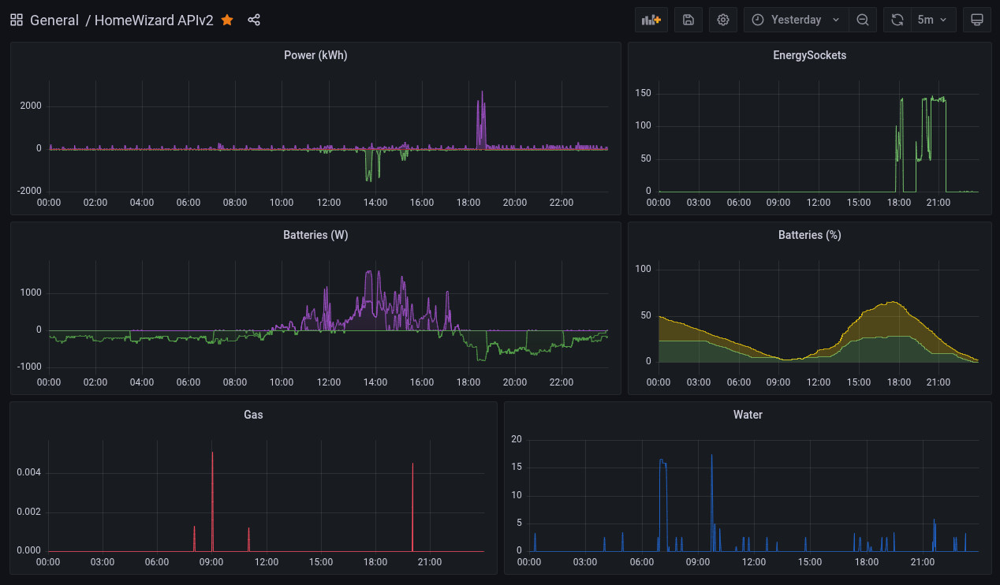

# homewizard-apiv2-exporter

Prometheus exporter for HomeWizard equipment, reading both APIv1 and APIv2.


*(example graphs showing individual batteries)*

Docker hub link: https://hub.docker.com/r/jcq81/homewizard-apiv2-exporter

## Index

- [Configuration](#configuration)
- [User managemenet tools](#user-management-tools)
- [Docker](#docker)

## Configuration

For APIv2 a config file is required containing the authentication tokens, see example.

```yaml
cloud:
  token: NONE
targets:
  - host: MyHwDevice1
    token: YOURTOKENGOESHERE
  - host: MyHwDevice2
    token: YOURTOKENGOESHERE
```

Prometheus configuration example:

```yaml
  - job_name: "homewizard-apiv2"                             
    static_configs:                                         
      - targets: ["MyHwDevice1","MyHwDevice2"]              
    relabel_configs:                                        
      - source_labels: [__address__]                        
        target_label: __param_target                        
      - source_labels: [__param_target]                     
        target_label: instance                              
      - target_label: __address__                           
        replacement: 127.0.0.1:9898
```

## User management tools

This repository includes some scripts to add, list and/or delete users on your HomeWizard device.

Use these at **your own risk !!**

Run the script and follow the instructions. For help:

```bash
./useradd.py -h
./userlist.py -h
./userdel.py -h
```

## Docker

Docker compose:

```bash
docker-compose up -d
```

Manual run:

```bash
docker run -d --name homewizard-apiv2-exporter \
  -p 9898:9898 -e PORT=8282 \
  -v ./homewizard-apiv2-exporter.yml:/app/homewizard-apiv2-exporter.yml \
  jcq81/homewizard-apiv2-exporter
```

Manual build and run:

```bash
docker build -t homewizard-apiv2-exporter .
docker run -d --name homewizard-apiv2-exporter \
  -p 9898:9898 -e PORT=8282 \
  -v ./homewizard-apiv2-exporter.yml:/app/homewizard-apiv2-exporter.yml \
  homewizard-apiv2-exporter
```
